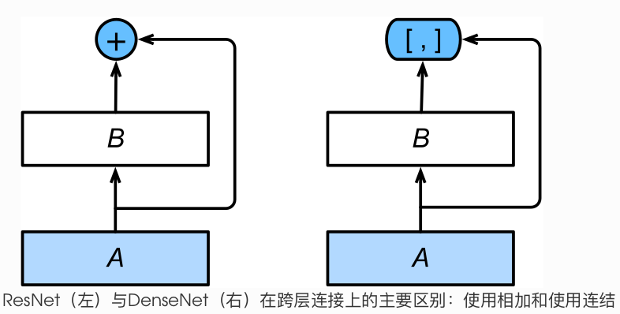
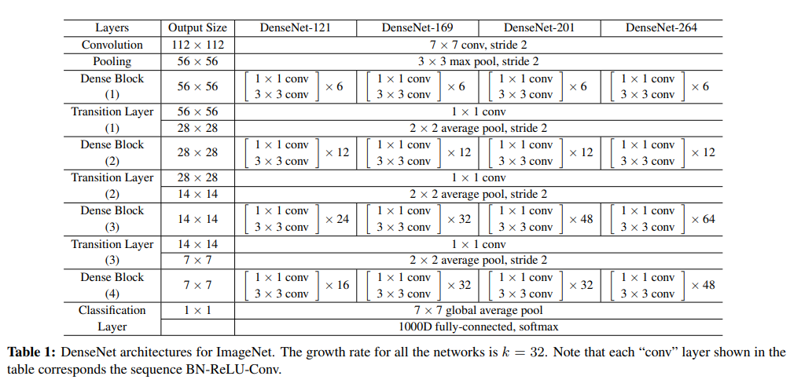

# DenseNet
[DenseNet](https://arxiv.org/pdf/1608.06993.pdf)与ResNet区别主要在于它将ResNet的残差块中的相加变为了channel的连结。

DenseNet的主要构建模块是稠密块(dense block)和过渡层(transition layer)。前者定义了输入和输出是如何连结的,后者则用来控制通道数,使之不不过大。

### 1.稠密快
DenseNet使用了ResNet改良版的“BN->relu->conv”结构，它组成了基本的卷积块 conv_block。

稠密块由多个 conv_block 组成,每块使用相同的输出通道数。但在前向计算时,我们将每块的输入和输出在通道维上连结。

### 2.过渡层
由于每个稠密块都会带来通道数的增加,使用用过多则会带来过于复杂的模型。过渡层用来控制模型复杂度。它通过卷积层来减小通道数,并使用步幅为2的平均池化层减半高和宽,从而进一步降低模型复杂度。

### 3.模型结构

### 4.总结
- 在跨层连接上,不同于ResNet中将输入与输出相加,DenseNet在通道维上连结输入与输出。
- DenseNet的主要构建模块是稠密块和过渡层。