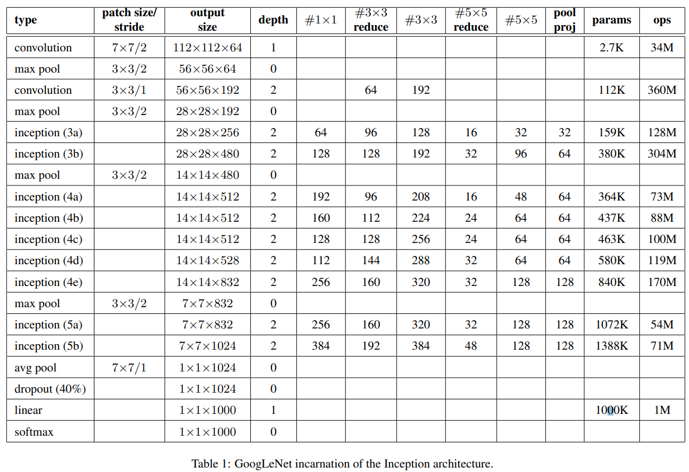

# GoogLeNet
[GoogleNet](https://static.googleusercontent.com/media/research.google.com/zh-CN//pubs/archive/43022.pdf)是2014年ImageNet图像识别挑战赛中的冠军。这里介绍的是其第一个版本。网络结构如下：

### 1.Inception块

Inception块结构

该块采用四条线路提取不同空间尺度下的信息，其中1x1卷计层用来减少输入通道数或调整输出通道数，以降低模型复杂度。4条线路都使用了合适的填充来使输入与输出的高和宽一致。

### 2.结构

### 3.总结
- Inception块相当于一个有4条线路的子网络。它通过不同窗口形状的卷积层和最大池化层来并行抽取信息,并使用1x1卷积层减少通道数从而而降低模型复杂度。
- GoogLeNet将多个设计精细的Inception块和其他层串联起来。其中Inception块的通道数分配之比是在ImageNet数据集上通过大量的实验得来的。
- GoogLeNet和它的后继者们一度是ImageNet上最高效的模型之一:在类似的测试精度下,它们的计算复杂度往往更低。