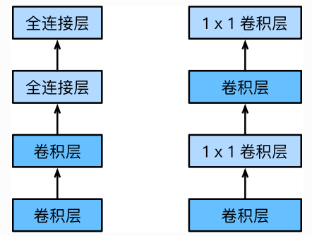

# NIN
全称[Network in network](https://arxiv.org/abs/1312.4400)，顾名思义，该网络的目的就是用某种方式堆叠小的网络。

左图展示了AlexNet和VGG的网络结构，右图展示了NiN的网络结构。

### 1.局部块

左图是AlexNet和VGG的网络结构局部,右图是NiN的网络结构局部

NiN块是NiN中的基础块。它由一个卷积层加两个充当全连接层的卷积层串联而成。其中第一个卷积层的超参数可以自行设置,而而第二和第三个卷积层的超参数一般是固定的。

如果要堆叠小模型，那么就无法避免全连接层，而将卷积结果的特征图转为全连接的维度转换，将耗费大量的资源。而使用1x1的卷积层正好可以完成这一替换。1x1的卷积层，可以看成全连接层，其中空间维度（高和宽）上的每个元素相当于样本，通道相当于特征。因此，NIN使用1x1卷积层来替代全连接层，从而使空间信息能够自然传递到后面的层。

### 2.替代FC，使用全局平均池化层求分类
NiN还有一个设计与AlexNet显著不不同:NiN去掉了了AlexNet最后的3个全连接层,取而代之地,NiN使用用了输出通道数等于标签类别数的NiN块,然后使用全局平均池化层对每个通道中所有元素求平均并直接用于分类。
这里的全局平均池化层即窗口形状等于输入空间维形状的平均池化层。
NiN的这个设计的好处是可以显著减小模型参数尺寸,从而缓解过拟合。然而,该设计有时会造成获得有效模型的训练时间的增加。

**NiN的以上设计思想影响了后面一系列卷积神经网络的设计。**