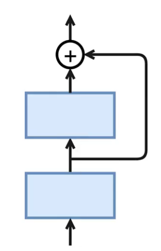
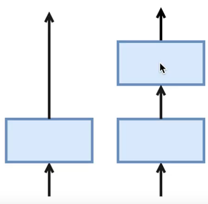
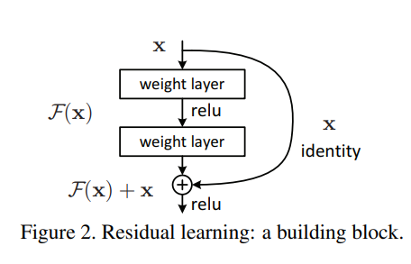
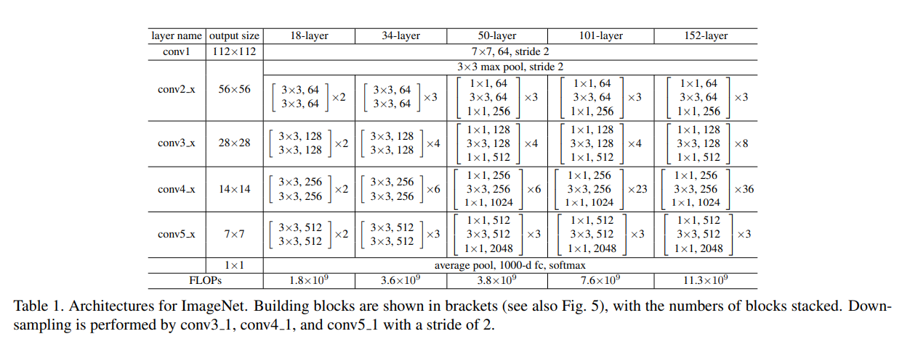
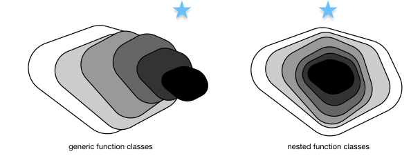

# ResNet
[ResNet](https://arxiv.org/pdf/1512.03385.pdf)有效的解决了深度卷积神经网络难训练的问题。梯度可以认为是信息量，当模型能够完全抽取数据的特征时，梯度就为零了，即模型完全收敛时，模型的梯度变为零。梯度的大小可以认为是你的模型还差多少能够拟合到数据。当做反向传播时，是从顶层往回传递的。而此时，误差很容易被离输出层近的层吸收掉。所以当模型深度很深的情况下，接近输出层的层很可能已经抓取了数据的信息，而到输出层时，梯度已经变为0.一旦梯度变为零，将会造成收敛变得很慢。

ResNet通过增加跨层的连接来解决梯度逐层回传时变小的问题。

下面演示了一个跨层的连接。

最底下那层的输入不仅仅是输出给中间层，而且其与中间层结果相加进入最上层。这样在梯度反传时，最上层梯度可以直接跳过中间层传到最下层，从而避免最下层梯度过小的情况。

为什么叫做残差网络呢？我们可以将上面示意图里的结构拆成两个网络的和，一个一层，一个两层，最下面层是共享的。

在训练过程中，左边网络因为更简单所以更容易训练，这个小网络没有拟合到的不封，称为残差，则被右边的网络抓取住。
所以直观上来说，即使加深网络，跨层连接仍然可以使得底层网络可以充分的训练，从而不会让训练更难。

### 1.Residual块

残差块里首先有2个有相同输出通道数的卷积层。每个卷积层后接一个批量归一化层和ReLU激活函数。

ResNet则使用4个由残差块组成的模块,每个模块使用若干个同样输出通道数的残差块。第一个模块的通道数同输入通道数一致。由于之前已经使用了步幅为2的最大池化层,所以无须减小高和宽。之后的每个模块在第一个残差块里里里将上一个模块的通道数翻倍,并将高和宽减半。

### 2.模型结构

### 3.复杂度对比

左：非嵌套函数类。实际上，随着复杂度的增加，距离可能会增加。右：使用嵌套函数类不会发生这种情况。¶

- 网络变宽是平方复杂度，容易过拟合。而变深是线性复杂度，效果更好。

### 4.总结
- 残差块通过跨层的数据通道从而能够训练出有效的深度神经网网络。
- ResNet深刻影响了后来的深度神经网络的设计。

## 参考
- 动手学深度学习课程